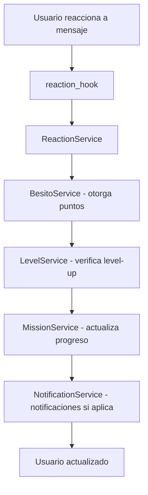

# Arquitectura del Módulo de Gamificación

## 🏗️ Visión General

El módulo de gamificación sigue una arquitectura de 4 capas con patrones de diseño orientados a servicios, inyección de dependencias y procesamiento asíncrono. La arquitectura permite una clara separación de responsabilidades y facilita la mantenibilidad y escalabilidad.

## 🧱 Estructura de Capas

### 1. Capa de Base de Datos
- **Tecnología**: SQLAlchemy 2.0 (async ORM)
- **Características**:
  - 13 modelos relacionados
  - Herencia de tablas para el sistema de Badges
  - Índices optimizados para consultas frecuentes
  - Restricciones de integridad referencial
  - Soft-delete para preservar historial

### 2. Capa de Servicios (Core)
- **Tecnología**: Python 3.11+ con async/await
- **Servicios Implementados**:

```
GamificationContainer (DI)
├── ReactionService
│   ├── Registro de reacciones
│   ├── Validación de emojis
│   ├── Control de spam
│   └── Integración con sistema existente
├── BesitoService
│   ├── Otorgamiento de besitos
│   ├── Operaciones atómicas (prevención de race conditions)
│   ├── Auditoría de transacciones
│   └── Control de límites
├── LevelService
│   ├── Gestión de niveles
│   ├── Cálculo automático de level-ups
│   ├── Progresión basada en besitos
│   └── Validación de rango de niveles
├── MissionService
│   ├── Gestión de misiones (CRUD)
│   ├── Tracking de progreso por usuario
│   ├── Validación de criterios
│   └── Reclamación de recompensas
├── RewardService
│   ├── Gestión de recompensas
│   ├── Condiciones de desbloqueo (unlock conditions)
│   ├── Compra con besitos
│   └── Sistema de badges raros
├── UserGamificationService
│   ├── Fachada unificada de perfil
│   ├── Agregación de datos de múltiples servicios
│   ├── Estadísticas de usuario
│   └── Formateo para display
└── NotificationService
    ├── Envío de notificaciones
    ├── Templates HTML para Telegram
    ├── Configuración por tipo
    └── Manejo de errores
```

### 3. Capa de Orquestación
- **Patrón**: Orquestadores transaccionales
- **Componentes**:

```
ConfigurationOrchestrator (Orquestador Maestro)
├── MissionOrchestrator
│   ├── Creación coordinada de misiones
│   ├── Auto-creación de niveles/recompensas
│   ├── Transacciones atómicas
│   └── Validaciones complejas
└── RewardOrchestrator
    ├── Creación coordinada de recompensas
    ├── Construcción de unlock conditions
    ├── Validación de dependencias
    └── Creación masiva de badges
```

### 4. Capa de Handlers (UI)
- **Tecnología**: Aiogram 3.4.1 (FSM, callbacks, keyboards)
- **Componentes**:

```
Admin Handlers
├── Menú Principal
├── Wizards de Configuración (misión, recompensa, nivel)
├── CRUD de Entidades
├── Plantillas Predefinidas
└── Estadísticas del Sistema

User Handlers
├── Perfil de Usuario
├── Misiones Activas
├── Recompensas Disponibles
├── Leaderboards
└── Compras con Besitos
```

### 5. Background Jobs
- **Tecnología**: asyncio, apscheduler
- **Componentes**:

```
Background Jobs
├── auto_progression_checker
│   ├── Verificación periódica de level-ups
│   ├── Procesamiento en batch
│   └── Notificaciones automáticas
├── streak_expiration_checker
│   ├── Reset de rachas expiradas
│   ├── Configuración de threshold
│   └── Notificaciones condicionales
└── reaction_hook
    ├── Eventos de reacción en tiempo real
    ├── Procesamiento asíncrono
    └── Integración con servicios
```

## 🔄 Flujo de Datos de Reacción



## 🔧 Inyección de Dependencias

El sistema utiliza un contenedor de inyección de dependencias (`GamificationContainer`) que implementa:
- Lazy loading para eficiencia
- Singleton pattern para consistencia
- Integración con sistema existente
- Gestión de ciclo de vida de servicios

## 📊 Validaciones y Seguridad

- Validación de estructuras JSON para criterios y metadata
- Control de acceso basado en roles
- Prevención de race conditions en operaciones de besitos
- Transacciones atómicas para operaciones complejas
- Logging detallado para debugging y auditoría

## ⚡ Performance y Escalabilidad

- Consultas SQL optimizadas con joins
- Cache de configuraciones en memoria
- Procesamiento en batch para operaciones masivas
- Conexiones a base de datos reutilizadas
- Patrones asincrónicos para alta concurrencia

## 🔌 Integración con Sistema Existente

- Compatibilidad con estructura existente de bot
- Uso compartido de base de datos principal
- Integración con sistema de admin existente
- Uso de mismo sistema de estados (FSM)
- Compatibilidad con handlers existentes