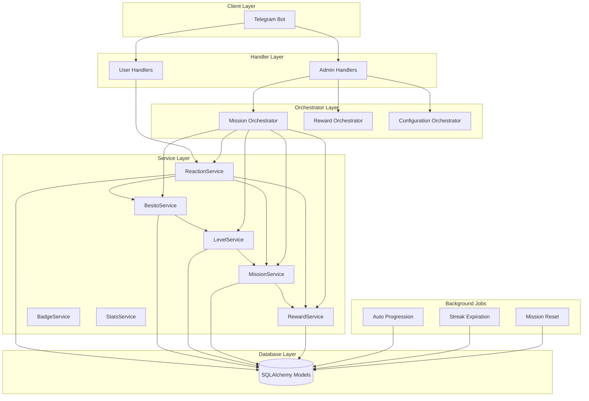

# Arquitectura del Módulo de Gamificación

## Índice
- [Visión General](#visión-general)
- [Capas del Sistema](#capas-del-sistema)
- [Diagrama de Arquitectura](#diagrama-de-arquitectura)
- [Flujo de Datos](#flujo-de-datos)
- [Modelos de Base de Datos](#modelos-de-base-de-datos)
- [Servicios](#servicios)
- [Orchestrators](#orchestrators)
- [Background Jobs](#background-jobs)

## Visión General

El módulo de gamificación está diseñado con una arquitectura limpia y modular que permite extensibilidad y mantenimiento fácil. La arquitectura se divide en varias capas bien definidas que siguen principios de responsabilidad única y acoplamiento débil.

## Capas del Sistema

1. **Database Layer**: 13 modelos SQLAlchemy para persistencia
2. **Services Layer**: 7 servicios principales con contenedor de inyección de dependencias
3. **Orchestrators Layer**: 3 orchestrators para workflows complejos
4. **Handlers Layer**: Handlers de admin y usuario
5. **Background Jobs**: Procesos automáticos para progresión y expiración de rachas

## Diagrama de Arquitectura



## Flujo de Datos

Cuando un usuario realiza una acción que desencadena el sistema de gamificación, el flujo es el siguiente:

```
Usuario reacciona → ReactionHook → ReactionService → BesitoService → LevelService → MissionService
```

1. Un usuario envía un mensaje en un canal
2. Alguien reacciona al mensaje con emojis configurados (como ❤️, 👍, etc.)
3. El hook de reacción detecta la reacción
4. El ReactionService registra la interacción
5. El BesitoService otorga besitos al emisor del mensaje
6. El LevelService verifica si se alcanza un nuevo nivel
7. El MissionService actualiza progreso de misiones relacionadas
8. El sistema notifica al usuario de cambios

## Modelos de Base de Datos

El sistema utiliza 13 modelos principales:

### Usuario y Perfil (`models/user.py`)
- `User`: Información básica del usuario de Telegram
- `UserProfile`: Perfil gamificado con estadísticas

### Economía (`models/besitos.py`)
- `BesitoTransaction`: Transacciones de besitos
- `BesitoBalance`: Saldo actual de besitos por usuario

### Niveles y Progresión (`models/level.py`)
- `Level`: Definición de niveles
- `UserLevel`: Nivel actual de cada usuario
- `Experience`: Sistema de experiencia y puntos

### Misiones (`models/mission.py`)
- `Mission`: Definición de misiones
- `UserMissionProgress`: Progreso individual de misiones
- `MissionTemplate`: Plantillas reutilizables

### Recompensas (`models/reward.py`)
- `Reward`: Recompensas disponibles
- `UserReward`: Recompensas obtenidas por usuarios
- `UnlockCondition`: Condiciones para desbloquear elementos

### Estadísticas (`models/stats.py`)
- `UserStats`: Estadísticas detalladas de actividad

## Servicios

### ReactionService
Responsable de procesar reacciones y registrar interacciones.

- `record_reaction(user_id, emoji, message_id, channel_id, reacted_at)`
- `validate_reaction(emoji, message_id, user_id)`
- `apply_reaction_effects(reaction_data)`

### BesitoService
Maneja la economía de besitos.

- `award_besitos(user_id, amount, reason)`
- `get_user_balance(user_id)`
- `transfer_besitos(sender_id, receiver_id, amount)`

### LevelService
Controla el sistema de niveles y progresión.

- `calculate_level(xp_points)`
- `update_user_level(user_id, new_xp)`
- `check_level_up(user_id)`

### MissionService
Administra misiones y progreso.

- `create_daily_missions()`
- `update_mission_progress(user_id, mission_id, progress)`
- `claim_mission_rewards(user_id, mission_id)`

### RewardService
Gestiona recompensas y condiciones de desbloqueo.

- `grant_reward(user_id, reward_id)`
- `check_unlock_conditions(user_id, item_id)`
- `apply_template_rewards(template)`

### BadgeService
Maneja badges e insignias coleccionables.

- `award_badge(user_id, badge_id)`
- `get_user_badges(user_id)`
- `create_badge_definition(badge_data)`

### StatsService
Calcula y proporciona estadísticas.

- `get_user_statistics(user_id)`
- `get_leaderboard(limit=10)`
- `get_channel_stats(channel_id)`

## Orchestrators

### Mission Orchestrator
Coordina la creación y gestión de misiones complejas.

- Gestión de misiones diarias/semanales
- Sincronización con otros servicios
- Validación de reglas de negocio

### Reward Orchestrator
Orquesta recompensas complejas y desbloqueos.

- Aplicación de plantillas de recompensas
- Validación de condiciones de desbloqueo
- Coordinación con servicios externos

### Configuration Orchestrator
Gestiona la configuración del sistema de gamificación.

- Aplicación de plantillas
- Validación de parámetros globales
- Sincronización entre servicios

## Background Jobs

El sistema incluye varios trabajos en segundo plano:

### Auto Progression
- Corre cada 6 horas por defecto
- Calcula y aplica progresión automática
- Verifica condiciones de nivel

### Streak Expiration
- Controla la expiración de rachas
- Reinicia contadores de racha si es necesario

### Mission Reset
- Resetea misiones diarias/semanales según cronograma
- Prepara nuevas misiones para el ciclo